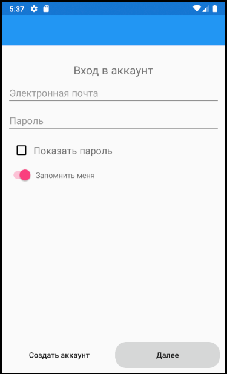
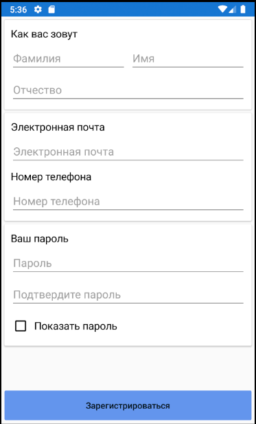
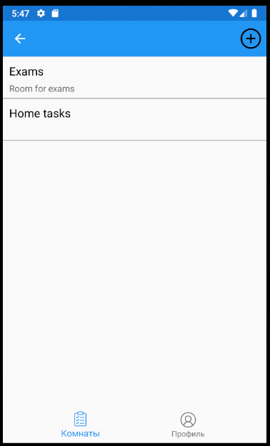
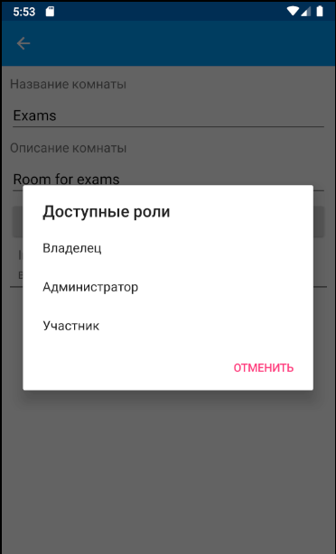
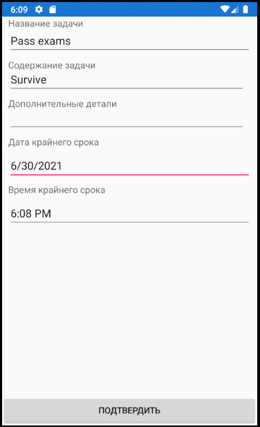
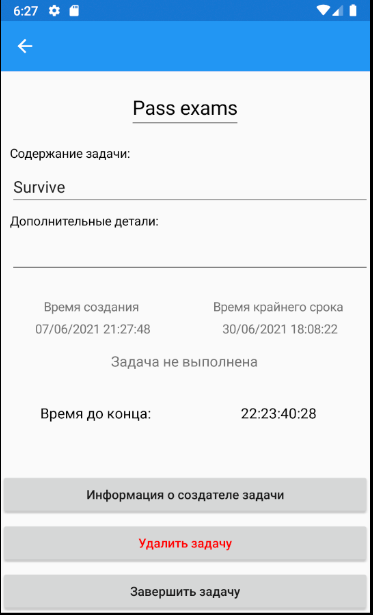

# Work planner Xamarin Android App

Frontend part for my project "Work planner"

See project description in [backend part](https://github.com/Inozpavel/WorkPlanner.WebApi)

This is an Android mobile app made on Xamarin

## Pages

### Login page

### Registration page

### Rooms page

### Room information page with open dialog for changing user permission

### Tasks page

### Task creation page

### Created task information page

